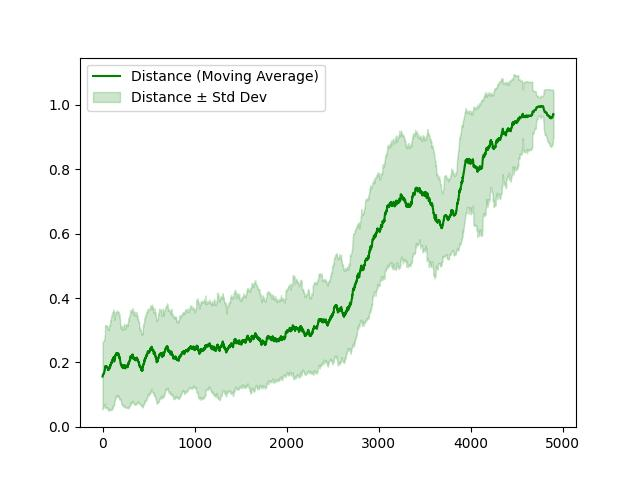
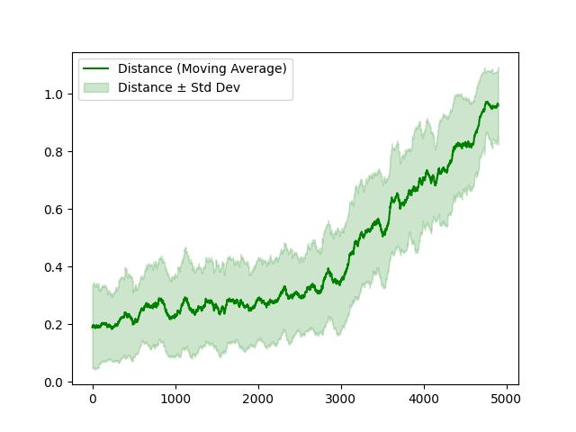
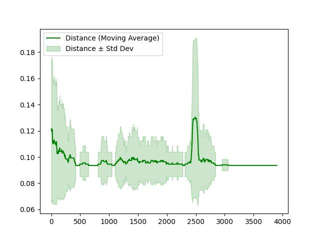
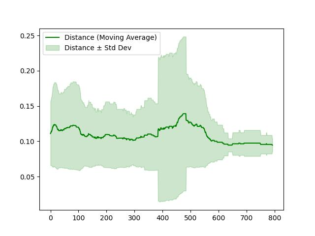

# Reinforcement Learning A3C + Curiosity for Super Mario Bros

This repository contains a PyTorch implementation of Super Mario Bros based on the paper [Curiosity-driven Exploration by Self-supervised Prediction](https://github.com/pathak22/noreward-rl). The goal of the project is to create a model capable of winning the game using three different environments: dense, sparse, and no-reward. To achieve this, we implemented the A3C algorithm with an added intrinsic reward mechanism based on curiosity.
- **Pre-trained models:** Best-performing models for each environment are available in the `checkpoints` directory.
- **Training logs and metrics:** Visualizations and logs for all training sessions are stored in the `log` directory.

### Prerequisites

1. Dependencies listed in `requirements.txt`

### Installation

1. Clone the repository and install dependencies:
   ```bash
   git clone https://github.com/yourusername/repo-name.githttps://github.com/Francesco0101/RL-A3C-Curiosity-Super-Mario.git
   cd RL-A3C-Curiosity-Super-Mario
   pip install -r requirements.txt
   ```
2. Training: hyperparameters are in `utils/constants.py` and in `train.py`
   ```bash
   python3 train.py 
   ```
3. Testing: In order to run the correct model load the checkpoint you want to evaluate modifying the variable in the function `eval()`
   ```bash
   python3 eval.py
   ```
4. Plotting: In order to plot the results  modify the `plot()` function with the desired log directory 
   ```bash
   python3 plot.py 
   ```

## Plot 
<div align="center">
  <h3> Comparison Between Dense Environments</h3>
  <table>
    <tr>
      <td align="center">
        
        <br>
        <b>Dense using A3C + Curiosity</b>
      </td>
      <td align="center">
        
        <br>
        <b>Dense Using A3C without Curiosity</b>
      </td>
    </tr>
  </table>
</div>

<div align="center">
  <h3> Comparison Between Sparse Environments</h3>
  <table>
    <tr>
      <td align="center">
        
        <br>
        <b>Sparse using A3C + Curiosity</b>
      </td>
      <td align="center">
        
        <br>
        <b>Sparse Using A3C without Curiosity</b>
      </td>
    </tr>
  </table>
</div>

<div align="center">
  <h3> Comparison Between No-Reward Environments</h3>
  <table>
    <tr>
      <td align="center">
        
        <br>
        <b>No-Reward using A3C + Curiosity</b>
      </td>
      <td align="center">
        
        <br>
        <b>No-Reward Using A3C without Curiosity</b>
      </td>
    </tr>
  </table>
</div>

## Results Analysis
### Dense Environment
- **With Curiosity:** The agent manage to consistently reach the flag after approximately 4500 games.  
- **Without Curiosity:** The agent manage to consistently reach the flag after approximately 5000 games.  
**Conclusion:** Slightly faster convergence using curiosity.

### Sparse Environment
- **With Curiosity:** The agent almost reaches the flag remaining stuck on last staircase.  
- **Without Curiosity:** Performance is very poor, failing to even jump the second large tube.  
**Conclusion:** Curiosity significantly improves performance in sparse reward environments.

### No-Reward Environment
- **With Curiosity:** The agent achieves a peak of 36% level completion (first hole).  
- **Without Curiosity:** The agent performs poorly, achieving only 28% level completion (first large tube).  
**Conclusion:** Although both perform poorly, curiosity enables the agent to learn better and achieve higher level completion.
   
